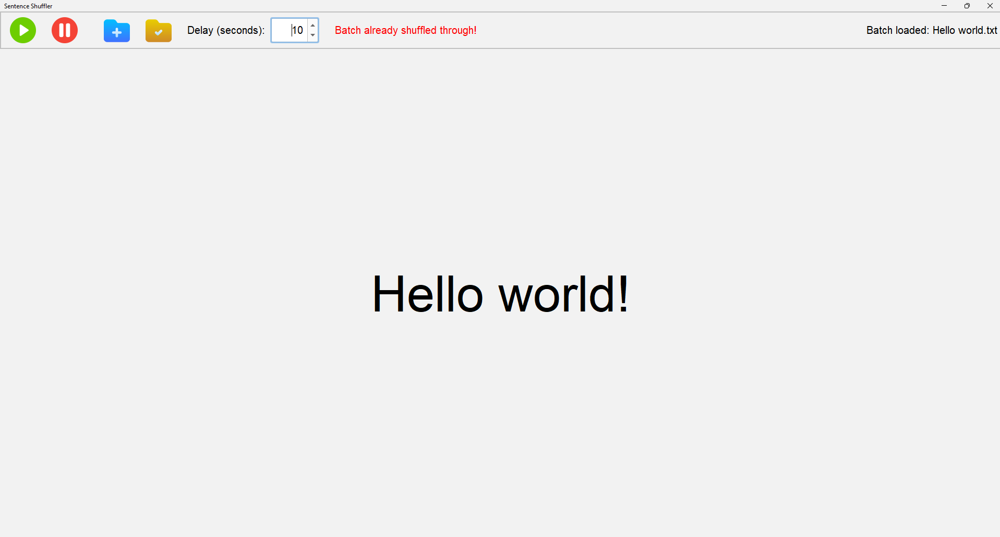

# Sentence Shuffler  
**A Ready-to-Use Desktop App for Shuffling Sentences (for now)**  

  

## Features ✨  
- 🚀 **No Installation Required** – Run directly from the EXE file  
- 📖 **Display Panel** – Large text area to show shuffled sentences  
- ⏱️ **Adjustable Delay** – Set time between sentences (1-180 seconds)  
- 📂 **Load Text Files** – Supports .txt files (1 sentence per line)  
- 🔄 **Smart Shuffling** – Avoids repeating the same sentence consecutively  
- 🚨 **Traversal Alert** – Visual warning when all sentences have been cycled  
- 🗂️ **Workspace Setup** – Choose a default directory for file operations  

## How to Use 🖱️  
1. **Download** the EXE file from the [Releases section](https://github.com/yourusername/yourrepo/releases).  
2. **Run** `SentenceShuffler.exe` (Windows users may need to allow permissions).  
3. **Load Sentences**:  
   - Click the `Open` button (folder icon) to select a .txt file  
   - Example file format:  
     ```  
     Hello world!  
     Practice makes perfect.  
     Think outside the box.  
     ```  
4. **Set Delay**: Choose interval (in seconds) using the numeric spinner.  
5. **Start Shuffling**: Click the `Run` button (play icon).  
6. **Stop Anytime**: Click the `Stop` button (square icon).  

## Interface Overview 🖥️   
1. **Control Panel** (Top Bar) (In order from left to right):
   - `Run/Stop` – Start/pause shuffling   
   - `Open` – Load text files  
   - `Set Directory` – Choose workspace folder  
   - Delay selector – Adjust time between sentences  
3. **Display Panel** (Main Area):  
   - Shows current sentence in large, auto-resizing text  
   - Red warning appears when all sentences are cycled  

## Troubleshooting ⚠️  
- If the app doesn’t launch:  
  - Ensure your OS is **Windows 10/11** (64-bit)  
  - Install [Microsoft Visual C++ Redistributable](https://aka.ms/vs/17/release/vc_redist.x64.exe) if required  
- File loading issues:  
  - Use plain .txt files (no rich formatting)  
  - Check file encoding (use UTF-8)  

## FAQs ❓  
**Q: Can I use this on macOS/Linux?**  
A: Currently, only Windows EXE is provided. Linux/macOS users can compile from source (Java required).  

**Q: How do I set a workspace directory?**  
A: Click the `Set Directory` button (gear icon) and select a folder.  

**Q: Why does the "Batch already shuffled" message appear?**  
A: It means all sentences have been displayed once. The list reshuffles automatically!  

## Contributing & Source Code 💻  
This app is built with Java Swing. Developers can:  
1. Clone the repository  
2. Import into Java IDE (e.g., IntelliJ/Eclipse)  
3. Compile and modify the [source code](https://github.com/yourusername/yourrepo).  
